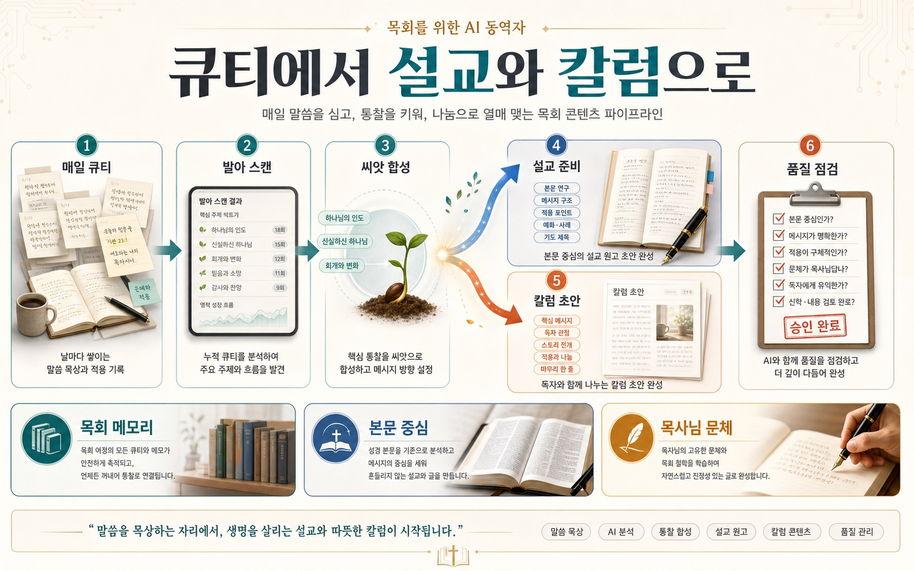

# 🕊️ Pastor-KR (High-Precision Pastoral AI Toolkit)

> **버전 (Version): v2.21 (Genre Contract & Series Arc — 장르 판정 정식 산출 · 시리즈 중간 점검)**
> *이전: v2.20 (Rhythm & Retrospect — 큐티 리듬 엔진 · 커버리지 조망 · 월간 형성 스냅샷 · 발행물 회고 · 지면 마감 리듬 · schema v3)*

**"오케스트레이터 + 전문가 길드 + 목회 메모리" 아키텍처 기반의 고성능 한국어 목회 지원 AI 스킬셋.**
단 하나의 진입점(`Pastor-Concierge`)을 통해 복잡한 스킬 선택의 고민 없이 목회 워크플로우를 자동화하며, **매 세션 진입 시 진행 중인 사역(설교/시리즈/심방)과 절기 컨텍스트를 자동 복원**합니다. 나아가 **매일의 큐티가 누적되어 설교와 칼럼으로 자연스럽게 발아**하도록 돕습니다 (v2.11). v2.12에서는 이 발아 파이프라인이 주간 리듬·품질 게이트·메모리와 빈틈없이 맞물리도록 정합을 마쳤고, **v2.14에서는 묵상 자체를 더 깊이 떠받칩니다** — 큐티 시작에 본문 컨텍스트를 마련하고(브리핑), 주해 이후 다시 묵상하며(재묵상), 반복해 돌아오는 긴장까지 발아 후보로 삼는 '깊은 렉시오(Deep Lectio)' 층을 더했습니다. **v2.15는 이 파이프라인을 나선으로 완성합니다** — 선포가 남긴 긴장이 다음 묵상으로 되먹이고(되먹임 루프), 본문이 먼저 정해진 주간에는 과거 큐티를 거둬 와 씨앗을 만들며(본문 정박 수확), 발아의 혈통이 산출물에 남습니다(seed_refs·씨앗 거울·일화 검증). v2.16은 **네 번째 물길**을 엽니다 — 목회자의 큐티가 성도용 묵상으로도 흘러가고(층위 분리로 내면은 보호), 주간 세트가 교회 전체를 한 본문 안에 살게 하며, 감사와 칼럼이 대상·지면을 알게 됩니다. v2.17은 **동행 자체를 오래가게** 다듬습니다 — 매일 큐티가 그날의 결(강도·질문 각도·절기)을 알고, 한 본문의 전 생애가 가계도로 보이며, 시스템 밖에서 태어난 원고도 입양으로 합류합니다. v2.18은 **끊긴 되먹임 루프를 잇습니다** — 하류 스킬이 상류 산출물을 자동으로 읽고(복붙 인수인계 종식), 지난 회고가 다음 설교의 기획에서 먼저 만나지며, 칼럼이 자기 아카이브를 돌아보고, 설교가 강단에 오르기 전 '귀'로 점검받습니다(낭독 리허설). v2.19는 **품질 장치를 생성의 자리로 앞당깁니다** — 칼럼이 목회자의 내밀한 층을 스스로 거르고(층위 게이트), 도덕주의 결론·설교조를 출력 전에 자가 점검하며, 성도 묵상은 페르소나가 없어도 눈높이를 지키고, 제목과 첫 문장은 후보 중에서 목회자가 고릅니다. v2.20은 **지속과 조망을 떠받칩니다** — 큐티가 사흘 비면 비서가 조용히 초대하고(리듬 엔진), 묵상의 편식이 지도로 보이며(커버리지 조망), 칼럼·성도 묵상도 회고 루프를 갖고(발행물 회고), 지면 마감을 비서가 먼저 챙깁니다. v2.21은 **두 계약을 닫습니다** — 주해가 장르를 정식으로 판정해 개요 골격이 그 결을 실제로 따르고(장르 계약), 진행 중 시리즈는 회차 회고를 되먹여 남은 아크를 점검받습니다(중간 점검).

> **처음 쓰시나요?** AI 도구가 익숙하지 않은 목회자를 위한 단계별 안내는 [USER_GUIDE.md](USER_GUIDE.md)에 있습니다. 아래 "1분 가동"이 어렵게 느껴지시면 그쪽을 먼저 보십시오.



**Pastor-KR**은 목회 현장의 고유한 맥락을 깊이 이해하고, 실제적인 사역 결과물을 만들어내는 **고성능 한국어 목회 지원 AI 스킬셋**입니다. 

### 🧥 자신만의 맞춤옷을 만들어 입으십시오
이 도구들은 단순히 정해진 답을 내놓는 자판기가 아닙니다. 각 목회지의 상황과 성도들의 필요는 모두 다릅니다. 제공된 스킬셋을 기반으로 목사님만의 고유한 신학적 철학과 목양의 언어를 덧입혀, **'우리 교회에 가장 잘 어울리는 맞춤옷'**으로 완성해 나가시기를 권장합니다. `core/foundation.md`를 수정하거나 각 스킬의 지침을 조정하는 과정 자체가 곧 목사님의 사역을 AI와 함께 빚어가는 거룩한 동역이 될 것입니다.

---

## 🚀 1분 만에 사역 비서 가동하기 (Quick Start)

가장 간편한 방법입니다. 사용하시는 AI(Antigravity, Cursor, Claude Code, Codex 등)에게 **아래 문구와 저장소 주소를 복사해서 보내기만 하세요.**

> **"아래 깃허브 저장소의 모든 지침을 로드해 줘. 별도의 지시가 없더라도 전용 프로젝트 폴더(`pastor-ai-toolkit`)를 생성하여 툴킷을 구성하고, `USER_GUIDE.md`를 학습하여 나를 돕는 수석 비서 'Pastor-Concierge' 모드로 가동해 줘. 앞으로 내가 자연어로 사역 요청을 하면, 네가 의도를 파악해서 가장 적합한 스킬로 안내해 줘야 해."**
>
> **📍 저장소 주소:** `https://github.com/mitmirsein/pastor-ai-skills-kr.git`

*(URL 인식이 어려운 환경이라면, 파일을 내려받아 직접 업로드하거나 폴더를 공유해 주세요.)*

---

## 🌟 프로젝트의 핵심 가치 (v2.21 업데이트)

1. **인지 부하 최소화 (오케스트레이터):** 32개의 스킬 + 3개의 harness 도구를 외울 필요가 없습니다. `00_pastor_concierge`에게 자연어로 말하면 최적의 스킬을 매칭해 줍니다.
2. **단절 없는 워크플로우 (파이프라인):** 하나의 작업이 끝나면 `Call to Action`을 통해 다음 단계(예: 큐티 발아 ➔ 브레인스토밍 ➔ 주해 ➔ 개요 동반작성 ➔ 검증 ➔ 블로그 발행)를 자연스럽게 제안합니다.
3. **정밀도 최극대화 (전문가 길드):** 범용 프롬프트 대통합의 함정을 피하고, 각 목적에 특화된 개별 에이전트들의 페르소나를 완벽히 보존합니다.
4. **추론적 온톨로지(Inferential Ontology):** 별도의 데이터베이스 없이도 AI가 본문의 핵심 개념을 엔티티(Entity)와 관계로 해체하여 분석하는 논리가 탑재되어 있습니다. (적용: `sermon-research`, `biblical-dilemma-solver`, `sermon-brainstorming`, `sermon-red-team`, `devotional-generator`, `small-group-guide`, `sermon-cardnews-maker`)
5. **🪔 목회 메모리 (v2.5 신규):** `core/pastor_journal.md`에 진행 중인 설교/시리즈/심방/기도제목이 자동 누적·갱신됩니다. Concierge는 매 세션 진입 시 이를 의무 로드하여, 콜드 스타트 없이 사역의 흐름을 이어갑니다. (PII 보호: 직분+이니셜만 기록)
6. **🗓️ 절기 자각 (v2.5 신규):** `core/liturgical_calendar.md`가 교회력(대림~일반)과 한국 교회 고유 절기(맥추/추수/송구영신/종교개혁/어린이/어버이)를 매핑합니다. "이번 주일 뭐 할까?"라는 모호한 질문에도 절기 흐름을 결합한 본문 후보가 제시됩니다.
7. **📜 본문 중심 lineage (v2.5 신규):** 동일 본문에 대한 모든 작업물이 `outputs/sermons/{passage_id}/`라는 하나의 폴더에 누적되며, `_manifest.md`가 작업 이력을 한눈에 보여줍니다. "이 본문 어디까지 했지?"가 즉시 보입니다.
8. **🛠️ 메타 도구 (v2.6 Tier 2):** `recall`과 `weekly-briefing`이 v2.5가 쌓은 자산을 **꺼내 쓰는 도구**를 제공합니다. "지난번 마태 5장 어떻게 했지?"(recall) 한마디로 과거 lineage를 인덱싱하고, 월요일 아침 한 장(weekly-briefing)으로 지난 주 사역과 이번 주 우선순위를 파악합니다.
9. **🛑 발행 품질 게이트 (v2.7):** `harness/sermon_audit`이 발행 전 사역물을 5대 렌즈(원어·신학·Foundation·회중·논리)로 검수하여 80점 미만 시 발행을 차단합니다. v2.8부터 채점 전 **Claim Ledger(주장 증거표)** 작성이 의무이며, 검증 불가 항목은 감점이 아니라 **채점 보류**로 정직하게 처리합니다.
10. **📖 본문 팩 우선 (v2.8 신규):** 성경 본문을 다루는 모든 스킬은 분석 전에 본문 전문을 확보합니다 — `data/scripture/` 슬롯(사용자 로컬 주입) 또는 붙여넣기. **기억으로부터의 성경 인용을 금지**하여, 목회자의 비서에게 가장 치명적인 실패(그럴듯한 의역 혼합·존재하지 않는 절 번호)를 구조적으로 차단합니다.
11. **⚙️/📋 듀얼 모드 (v2.8 신규):** 파일 접근이 없는 챗 환경에서도 침묵 실패 없이 동작합니다 — 저장 대신 복사용 블록을 건네고, 그 사실을 정직하게 알립니다 (`core/_hooks.md`).
12. **🎙️ 목회자 보이스 (v2.9 신규):** `voice-setup`이 목사님의 실제 설교문에서 문체 지문을 추출해 `core/pastor_voice.md`에 카드로 보존합니다. 칼럼·블로그 등 발행물은 거장 모사가 아니라 **목사님 자신의 문체**가 기본값이 됩니다.
13. **🗓️ 주간 리듬 + 🔁 회고 루프 (v2.9 신규):** 비서가 먼저 챙깁니다 — 요일과 진행 상태를 교차해 "오늘의 권장 동선"을 제안하고(예: "금요일인데 아직 검증 전입니다"), 선포 후 `sermon-retro` 3분 회고가 lessons로 누적되어 다음 설교 준비에 반영됩니다.
14. **🧯 목양 안전 + 👥 회중 페르소나 (v2.10 신규):** 위기 상황(자해·학대·급성 위기)에서는 콘텐츠보다 전문 연계 안내가 먼저이며, 장례·투병 등 상황별 금기 언어("다 하나님의 뜻")를 차단합니다. 목회자가 정의한 회중 페르소나로 레드팀이 "회중석 시뮬레이션"을 수행합니다.
15. **🌱 큐티→설교/칼럼 발아 파이프라인 (v2.11 신규):** 본문을 갑자기 정해 자료를 뒤지는 대신, *매일의 큐티가 누적되어 자연스럽게 설교·칼럼으로 익습니다*. `qt-companion`(소크라테스식 매일 묵상 동행 + 대화 프로토콜) → `qt-germinate-scan`(반복 본문/주제 발아 후보, 읽기 전용) → `qt-germinate-seed`(씨앗 합성) → `sermon-brainstorming` → `sermon-outline-codraft`(개요 동반작성). 같은 씨앗은 `qt-to-column`으로 **칼럼**으로도 갈라집니다(초기 묵상 문체 기반 '내 문체' 또는 거장 문체 선택). 목회자의 초기 묵상 원문은 불가침으로 보존되며, 어떤 단계도 설교를 대필하지 않습니다.
16. **🧩 파이프라인 정합 (v2.12 신규):** v2.11이 놓은 발아 파이프라인을 시스템 전체와 **맞물리게** 했습니다 — ① stage 유효값의 단일 정의(`pastor_journal.md` §3.1.1 SSOT — 위생 검사 오탐 제거) ② **발행 전이 가드**(`_hooks.md` §3.6): 선포 전 칼럼·TTS 선작성이 설교를 조기 '발행 완료'로 만들지 않음 ③ **칼럼도 감사 게이트**: red-team을 거치지 않는 큐티 상류 칼럼까지 발행 전 `sermon_audit` 권장 ④ 주간 루프 통합: 리듬표·weekly-briefing·recall이 매일 큐티와 발아 상태를 인지(`outputs/devotionals/_index.md` 인덱스) ⑤ 원어 팩 게이트: 원어 정본(`data/scripture/source/`) 없이는 형태소 파싱 표를 만들지 않는 정직 강등.
17. **🔬 주해 스키마 정밀화 + 🧱 구조 완결성 사전 게이트 (v2.13 신규):** ① `sermon-research`의 주해 산출을 명시적 계약으로 정밀화했습니다 — 문맥적 위치(Pre/Post-text 논리 유형), Table A/B 표준 컬럼 스키마(상↔어휘상 분리·Louw-Nida·상호본문성/LXX·현대 렌즈), 목회적 리스크 관리, 그리고 **Big Idea·Action Plan 후보**(연구 제안이며 확정은 목회자와 `sermon-outline-codraft`의 몫 — 대필 아님). ② `harness/sermon_audit`에 **구조 사전 게이트(§4.0)**를 신설했습니다 — 절단·거부 시그니처·섹션 누락이 발견되면 채점을 진행하지 않고 `🛑 구조 결함`으로 즉시 반환합니다(5렌즈 산술 불변). *(자동 산출 파이프라인의 하드 게이트 개념을 마크다운 검수로 이식)*
18. **🌊 Deep Lectio — 묵상·설교 준비 심화 (v2.14 신규):** 행정이 아니라 *성서 묵상과 설교 준비 자체*를 더 깊이 떠받치는 다섯 확장입니다(모두 기존 스킬에 얹은 것, 신규 스킬 0). ① **묵상 전 본문 브리핑**(`qt-companion` 0단계): 큐티 시작에 앞서 책 속 위치·앞뒤 문맥·낯선 실재를 **출처 태그(`[본문 팩]`/`[서재 팩]`/`[일반 지식 — 검증 불가]`)와 함께** 오리엔테이션으로 건넵니다 — 해석·판정은 금지, 초기 묵상은 여전히 불가침. ② **본문 대질 질문**: 티키타카에서 실제로 던지는 질문 중 최소 하나가 본문 팩의 문구를 인용하도록 하여 묵상이 본문에서 미끄러지지 않게 합니다. ③ **남은 긴장 발아**(`qt-germinate-scan` 축 3): 여러 본문에 반복해 돌아오는 아포리아를 발아 후보로 — 재소환 유래는 분리 집계해 에코 루프를 막습니다. ④ **주해 이후 재묵상**(`qt-companion` 재묵상 모드): 주해가 처음 묵상을 어디서 확증·전복했는지 되짚되 설교 stage는 주해에 머뭅니다. ⑤ **서재 팩**(`data/commentary/` 슬롯): 사용권 있는 2차 문헌을 주입하면 주해·난제·브리핑이 파일 출처를 표기하며 인용하고, `sermon_audit` Claim Ledger 검증이 실제 대조로 격상됩니다(없으면 정직 폴백). 주석이 PDF면 `tools/pdf-extractor`(선택적 도구)로 마크다운 변환 후 넣습니다.
19. **🌀 Spiral Harvest — 나선 되먹임·본문 정박 수확 (v2.15 신규):** 발아 파이프라인이 직선에서 **나선**이 됩니다(신규 스킬 0). ① **되먹임 루프**: `sermon-retro`의 선택 코다("설교가 다 담지 못한 긴장")가 journal `open_tensions`(§3.7)로 남고 `qt-companion`이 재소환 소스로 읽습니다 — 선포는 묵상의 끝이 아니라 다음 묵상의 씨앗. 재소환 분리 집계가 에코 루프를 차단합니다. ② **본문 정박 수확**: 설교 본문이 정해졌으면 `qt-germinate-scan` 모드 2가 코퍼스 전체에서 연관 큐티를 4계층(직접>긴장>인접>주제, 근거는 목회자 문구 인용)으로 거둬 오고, 씨앗은 설교 본문에 정박된 교차 본문 합성이 됩니다. "설교 준비하자" 한마디로 진입하며 본문 미정이면 최근 2주 발아 스캔으로 — 수확이 비면 "맨땅 시작도 정당한 길"로 정직하게 안내합니다. ③ **혈통 태그**: 발아 산출물 YAML에 뿌리 큐티의 상대 경로(`seed_refs`)가 남습니다. ④ **씨앗 거울**: 개요 조립 후 씨앗의 반복된 초점이 개요에 살아있는지 **관찰로만** 비춥니다(내용 제안 금지 — 대필 거절 불변). ⑤ **일화도 Claim이다**: `sermon_audit` Claim Ledger 유형 ⑤가 일화·경험담의 실재성을 상류 원문과 대조합니다(유령 일화 → 감점, 각색은 무감점).
20. **🌊 Fourth Stream — 큐티→성도 묵상·회중 동행 (v2.16 신규):** 하나의 큐티가 설교·칼럼에 이어 **성도용 묵상**으로도 흘러갑니다(신규 스킬 `qt-to-devotional`, 스킬 30개). ① **층위 분리 게이트**: 큐티를 본문 통찰 층(성도와 나눔)과 목회자 내면 층(직무 성찰·자기 점검)으로 분류해 먼저 보여주고, 내면 층은 **기본 제외·옵트인** — 목회자의 내면을 보호하면서 묵상의 열매만 회중의 식탁에 올립니다. ② **회중 동행 주간 세트**: `devotional-generator`가 6일치(월~토) 세트를 빚습니다 — 지난 주일 설교의 주중 연장(심화) 또는 다음 주일 본문 예습. 교회 전체가 한 주간 같은 본문 안에 삽니다. ③ **감사 프로파일**: `sermon_audit`이 대상 유형(설교/칼럼/성도 묵상)별로 렌즈를 재조준합니다(산술 불변, §4.4) — 성도 묵상은 목양 안전 중점, 칼럼은 문체 충실도·클리셰 검출. ④ **지면 프로파일**: `foundation.md`에 지면(`column_venues`)을 등록하면 칼럼이 주보 600자와 기고 2,000자를 구분해 입습니다.
21. **🎚️ Companion Depth — 동행 심화·가계도·입양 (v2.17 신규):** 매일의 동행을 오래가게 다듬는 여덟 확장입니다(신규 스킬 0). ① **강도 다이얼**: "오늘은 짧게" 한마디로 침묵 동행(질문 0~1)/기본/깊음을 오갑니다 — 신호가 없으면 묻지 않습니다(매일의 마찰 금지). ② **질문 각도 메모리**: 동행자가 최근 큐티들의 질문 각도(관찰/긴장/이미지/형성/적용)를 기억해 어제와 다른 각도로 들어옵니다. ③ **절기 렌즈**: 브리핑에 교회력 1줄(`[교회력]` 태그 — 해석은 목회자 몫). ④ **본문 가계도**: "레위기 4장 가계도 보여줘" 한마디로 큐티→씨앗→주해→선포→칼럼→남은 긴장까지 한 본문의 전 생애를 시간축으로 봅니다(`recall`). ⑤ **입양·원고 등록**(`_hooks` §8): 종이 개요·과거 설교 원고를 무수정 보관으로 lineage에 편입 — `drafted` 단계가 실체를 갖고, 감사·회고·재생산이 실제 원고를 참조합니다. ⑥ **장르 문법**: 개요 골격이 본문 장르(내러티브/시가/서신/예언·율법)의 결을 따릅니다. ⑦ **칼럼 인덱스**: 발행 칼럼이 `outputs/columns/_index.md`에 1줄씩 누적됩니다. ⑧ **페르소나 변주**: 성도 묵상이 회중 페르소나(장년/청년/새신자)에 맞춰 옷을 갈아입습니다.
22. **🔗 Closed Loops — 되먹임 루프 폐쇄 (v2.18 신규):** 부지런히 쌓기만 하고 되읽지 않던 자산을 창작의 입력으로 되살립니다(신규 스킬 1 — `sermon-rehearse`, 스킬 31개). ① **상류 자동 참조**(`_hooks` §9): AGENT 모드에서 주해→개요→red-team이 직전 산출물을 자동으로 읽습니다 — 매주 반복되던 "복사해서 붙여넣기" 인수인계가 CHAT 폴백으로 물러납니다. 씨앗은 대화 원문을 뺀 `접합 블록`​만 넘겨 브레인스토밍 입력이 가벼워집니다. ② **회고 앞단 상기**: 지난 회고의 lesson이 검증 단계가 아니라 **다음 설교를 기획하는 자리**에서 1줄로 먼저 만나집니다. ③ **칼럼 아카이브 조회**: 칼럼을 쓰기 전에 과거 칼럼 주제와의 중복·연작 여지를 돌아봅니다. ④ **발아 퍼널**: 주간 브리핑이 "씨앗 {s}건 → 설교 진입 {b}건 → 선포 {p}건"으로 큐티→설교 전환을 처음으로 계량합니다. ⑤ **구술성 렌즈**: red-team이 '귀로 듣기'(호흡·입말·Big Idea 가청성)를 점검하고, ⑥ **낭독 리허설**(`sermon-rehearse`): 강단에 오르기 전 예상 소요 시간·긴 문장·문어체를 표지합니다 — 원고를 고쳐 쓰지 않습니다(대필 거절 불변). ⑦ **설교 인덱스**: `outputs/sermons/_index.md`가 쌓여 수백 본문 시대에도 회상·집계가 한 파일 스캔으로 끝납니다.
23. **✒️ Generative Quality — 생성 단계 품질 (v2.19 신규):** 품질 장치를 사후 감사에서 **생성의 자리**로 앞당깁니다(신규 스킬 0). ① **칼럼 층위 게이트 최소판**: 큐티에서 칼럼을 빚을 때 특정 성도 식별 언급·직무 기밀 고백 두 층만 옵트인으로 거릅니다 — 목회자의 1인칭 내면은 칼럼의 자산이므로 그대로 두되, 지면에 실리면 안 되는 것만 지킵니다. ② **자가 점검**: 칼럼이 출력 전에 도덕주의 결론("열심히 합시다")·설교조 잔존·상투 표현·제목-본문 약속을 스스로 확인합니다. ③ **눈높이 필터**: 성도 묵상이 페르소나 미설정 시에도 설명 없는 신학 용어를 상시 걸러 풀어씁니다. ④ **제목·리드 서브루틴**: 제목 후보 3개(품격/호기심/이미지)와 첫 문장 2개 중에서 목회자가 고릅니다 — 칼럼의 생사는 진입부에서 갈립니다. ⑤ **칼럼체 추정 변주**: 칼럼 샘플이 없어도 강단 보이스에서 지면용 변주(호명 제거·문단 단축)를 파생해 드립니다 — "(추정 — 확인 필요)" 표기와 함께, 실제 칼럼이 쌓이면 실측으로 교체.
24. **🕯️ Rhythm & Retrospect — 리듬·회고 (v2.20 신규):** 매일의 지속과 긴 조망을 시스템이 떠받칩니다(신규 스킬 1 — `publication-retro`, 스킬 32개 · journal schema v3). ① **큐티 리듬 엔진**: 큐티가 사흘 비면 비서가 헤더 아래 한 줄로 조용히 초대합니다 — 강요도 죄책도 없이, 기록이 아예 없으면 침묵합니다(`last_qt_date`는 날짜만 기록). ② **커버리지 조망**: "요즘 묵상 어디에 몰렸나" 한마디로 몰린 책과 오래 안 편 책이 보입니다 — 보여줄 뿐 처방하지 않습니다. ③ **월간 형성 스냅샷**: 질문 각도 분포·긴장 궤적·커버리지를 월 단위로 되짚습니다(요청 시). ④ **발행물 회고**: 칼럼·성도 묵상도 3문항 회고로 lesson을 남깁니다 — 품질 곡선이 설교에만 돌지 않습니다. ⑤ **지면 마감 리듬**: 지면 프로파일에 마감 규칙을 적어 두면 주간 브리핑이 임박 마감을 챙깁니다. ⑥ **발아 동선 재조정**: 설교 준비 주간에 2주 창이 비면 4주로 넓혀 한 번 더 보고, 본문이 정해졌으면 정박 수확이 1순위가 됩니다.
25. **📐 Genre Contract & Series Arc — 장르 계약·시리즈 아크 (v2.21 신규):** 신규 스킬 없이 두 개의 끊긴 계약을 닫습니다. ① **장르 판정 정식 산출**: 주해(`sermon-research`)가 본문의 지배 장르(내러티브/시가/서신/예언·율법/혼합)를 판정 근거와 함께 정식 필드로 내놓습니다 — 개요 골격이 "장르 판정이 있으면"이라고 기대만 하던 것이 실제로 공급되어, 내러티브 본문은 장면 순차 골격이, 시가는 병행법 골격이 **기본으로** 제시됩니다(판정이 어려우면 "혼합"으로 정직하게). ② **시리즈 중간 점검**: "시리즈 절반 왔는데 궤도 맞나?" 한마디로 진행 중 시리즈의 아크 위치·회차 회고의 반복 신호·남은 회차 조정 여지를 한 장으로 받습니다 — 조정은 제안까지이고 기획안 확정은 목회자의 자리이며, 회차 설교의 내용에는 손대지 않습니다.

---

## 📖 스킬 디렉토리 구조 (전문가 길드)

v2.5부터 모든 스킬은 목회자의 실제 워크플로우에 따라 5개의 직관적인 그룹으로 운영되며, 작업 결과가 `outputs/` 폴더에 **본문 중심 lineage** 방식으로 자동 저장됩니다.

### 🛎️ `00_pastor_concierge` (단일 진입점)
- `SKILL.md`: 사용자의 자연어 의도를 분석하여 아래의 5대 그룹(+harness·lenses)으로 라우팅해주는 최상위 수석 비서 (모드 판별·오늘의 동선 포함)

### 💎 `01_sermon_core` (설교 코어)
- `sermon-brainstorming.md`: 소크라테스식 문답을 통한 설교 인사이트 발굴
- `sermon-research.md`: 6 Gems 엔진 기반의 고정밀 주해 리포트 생성 (Table A/B 표준 스키마·문맥적 위치·목회적 리스크·Big Idea/Action Plan 후보, v2.13 · 서재 팩 2차 문헌 인용 격상, v2.14 · 장르 판정 정식 산출 — 개요 장르 문법의 상류 계약, v2.21)
- `biblical-dilemma-solver.md`: 성경 난제에 대한 입체적 변증 가이드
- `sermon-outline-codraft.md` *(v2.11 · v2.15 · v2.17)*: Big Idea·주해에서 설교 개요를 함께 세우기 — AI는 구조 비계만, 각 대지 내용은 목회자 저작(대필 아님). v2.15 — 조립 후 씨앗 거울(반복된 초점 반영 관찰, 내용 제안 금지). v2.17 — 본문 장르 문법(장르 판정 시 그 결의 골격 우선)
- `sermon-red-team.md` *(v2.18)*: 설교 원고나 개요의 신학적 맹점 및 회중 시선 분석. v2.18 — 4️⃣ 귀로 듣기 렌즈(호흡·입말·Big Idea 가청성·전환 신호)
- `sermon-series-planner.md` *(v2.21)*: 4-6주 단위의 강해 설교 시리즈 기획. v2.21 — **중간 점검 모드**: 진행 중 시리즈의 아크를 회차 회고와 대조해 남은 회차 조정을 제안(확정은 목회자, 회차 내용 불가침)
- `sermon-retro.md` *(v2.9 · v2.15)*: 선포 후 3분 회고 — lesson을 누적해 다음 설교에 반영. v2.15 — 선택 코다 "남은 긴장"이 journal `open_tensions`로 남아 다음 큐티로 되먹임(나선). v2.18 — lessons가 brainstorming·outline 시작 시에도 상기됨(기획 앞단 폐쇄 루프)
- `sermon-rehearse.md` *(v2.18 신규)*: 선포 직전 낭독 리허설 — 예상 소요 시간·호흡이 걸리는 문장·문어체·들리지 않는 개념어를 표지 (원고 개작 없음, stage 불변 — retro의 선포 전 대칭)
- `qt-germinate-scan.md` *(v2.11 · v2.14 · v2.15 · v2.20)*: 누적 큐티에서 반복되는 본문·주제를 설교 발아 후보로 제시 (읽기 전용, 강제 승격 없음). v2.14 — `## 남은 긴장`의 반복(아포리아)을 세 번째 발아 축으로, 재소환 유래는 분리 집계(에코 루프 차단). v2.15 — **모드 2(본문 정박 수확)**: 설교 본문이 정해졌을 때 연관 과거 큐티를 4계층으로 거둬 씨앗 재료로 추천. v2.20 — **모드 3(커버리지 조망)**: 몰린 책·오래 안 편 책의 분포를 보여주되 처방하지 않음
- `qt-germinate-seed.md` *(v2.11 · v2.15)*: 발아 후보의 큐티들을 시간순 원문 그대로 모아 설교 씨앗 메모로 합성. v2.15 — 정박 수확 태생 씨앗(설교 본문에 정박, 교차 본문 포함)·`seed_refs` 혈통 태그 자동 기록

### 🕊️ `02_pastoral_care` (목양 코어)
- `bible-study-generator.md`: 주해(Core)-교안(Lesson)-워크북(Workbook) 통합 성경공부 설계
- `small-group-guide.md`: 설교 메시지를 성도들의 삶으로 연결하는 나눔지(관찰/적용) 생성
- `devotional-generator.md`: 매일/주중 공유할 수 있는 짧은 QT/묵상 콘텐츠 제작 · v2.16 — 회중 동행 주간 세트 모드(월~토 6일치, 설교 본문 연동 심화/예습)
- `qt-companion.md` *(v2.11 · v2.14 · v2.17)*: 목회자 *자신*의 매일 큐티를 소크라테스식 문답(티키타카)으로 심화하고 대화 프로토콜로 기록 — 설교 발아의 토양. v2.14 — 묵상 전 본문 브리핑(출처 태그·옵트아웃)·본문 대질 질문·남은 긴장 재소환·주해 이후 재묵상 모드. v2.17 — 강도 다이얼(침묵/기본/깊음)·질문 각도 메모리·절기 렌즈
- `visitation-guide.md`: 상황별 심방 성구 및 목회적 권면 가이드

### 📢 `03_omni_publisher` (재생산 및 다매체 확산)
- `SKILL.md` (Sermon-Republisher): 설교 원고를 1회 입력받아 아래 포맷들로 분기 변환 안내 (Thin Router)
- `sermon-to-column.md` *(v2.19)*: **완성 설교**를 유진 피터슨/팀 켈러 풍(또는 내 보이스)의 고급 칼럼으로 리폼. v2.19 — 자가 점검(클리셰·도덕주의)·제목/리드 후보 선택
- `qt-to-column.md` *(v2.11 · v2.19)*: **큐티/발아 씨앗에서 바로** 칼럼을 빚기 — 문체는 초기 묵상 기반 '내 문체' 또는 거장 문체 선택, 실질은 목회자 묵상에서. v2.19 — 층위 게이트 최소판(성도 식별·직무 기밀 옵트인)·자가 점검·제목/리드 후보 선택
- `qt-to-devotional.md` *(v2.16 · v2.19)*: **목회자의 큐티/씨앗에서 성도용 묵상**을 빚기 — 층위 분리 게이트(통찰 층만 번역, 내면 층 기본 제외·옵트인), 실질은 목회자 묵상에서. v2.19 — 눈높이 자가 점검(상시)
- `sermon-to-blog.md`: 설교를 웹사이트/블로그 포스팅용 텍스트로 전환
- `sermon-to-tts.md`: 설교문을 3분 분량의 오디오 TTS 대본으로 변환
- `sermon-cardnews-maker.md`: 설교 핵심 내용을 4-5컷의 카드뉴스 기획 및 소셜 캡션 추출
- `publication-retro.md` *(v2.20 신규)*: 발행된 칼럼·성도 묵상의 독자 반응·lesson을 3문항으로 회고 — 지면·독자 축의 회고 루프(선포·회중 축은 `sermon-retro`)

### 📋 `04_church_admin` (행정 보조)
- `bulletin-helper.md`: 주보 광고 및 교회 소식 가독성 있게 정리
- `announcement-script.md`: 자연스럽고 따뜻한 강단 광고 스크립트 작성
- `pastoral-letter.md`: 절기 및 상황별 고품격 공식 목회 서신 작성
- `admin-email.md`: 정중하고 명확한 교회 행정 및 대외 비즈니스 이메일 작성
- `meeting-agenda.md`: 당회 및 제직회 등 각종 회의 안건 구조화

### 🛠️ `05_meta_tools` (메타 도구)
- `foundation-setup.md`: 첫 설치 시 교회·목회자 메타데이터 인터뷰 및 `core/foundation.md` 초기화
- `journal-show.md`: `pastor_journal.md` 현재 상태를 시각화된 대시보드로 표시
- `recall.md`: 자연어 질의로 `outputs/` 내 과거 사역 자산 검색·인덱싱 (읽기 전용) · v2.17 — 가계도 모드(한 본문의 전 생애를 시간축 트리로)
- `weekly-briefing.md`: 지정 기간 사역 다이제스트 + 다음 주 우선순위 3가지 + 메모리 헬스 체크 + 품질 추이(v2.10)
- `voice-setup.md` *(v2.9)*: 설교문 2~3편으로 보이스 카드 추출·확정 → `core/pastor_voice.md`

### 🛑 `harness/` (품질 보증 — v2.7 신규)
`skills/`와 분리된 **감사 전용 위계**입니다. 사역 *작업* 도구가 아니라 사역 *품질 보증* 도구로, 발행 차단 권한을 갖는 유일한 디렉토리입니다.
- `sermon_audit.md`: 발행 직전 사역물 5렌즈 포렌식 검수 (80점 fail-fast + Claim Ledger 증거표, v2.8 · 구조 사전 게이트 §4.0, v2.13 · 서재 팩 존재 시 Ledger 유형 ②·④ 실제 대조 격상, v2.14 · Ledger 유형 ⑤ 일화 실재성 — 유령 일화 검출, v2.15 · 대상 유형 프로파일 §4.4 — 설교/칼럼/성도 묵상, v2.16)
- `journal_lint.md`: `pastor_journal.md` 스키마·PII·표류·만료 점검 (주 1회 권장)
- `routing_eval.md` *(v2.10)*: Concierge 라우팅 회귀 골든셋 평가 (`tests/routing_cases.md`)
- `_README.md`: harness/ 운용 정책 및 책임 경계 문서

### 📚 `data/` (비서의 서재 — v2.8 · v2.14)
빈 **슬롯**으로 출시됩니다. 사용자가 보유한 성경 본문(`data/scripture/`)·신학 용어표(`data/terms/`)·**2차 문헌 서재 팩(`data/commentary/`, v2.14)**을 넣으면 스킬들이 자동 인지하여 인용 검증 품질이 올라갑니다 — 서재 팩이 있으면 주해·난제·묵상 브리핑이 파일 출처를 표기하며 인용하고 `sermon_audit` Claim Ledger가 실제 대조로 격상됩니다(없으면 정직 폴백). 저작권 자료는 커밋 금지(.gitignore) — 규약: `data/_README.md`

### 🔭 `lenses/` (주제 렌즈 팩 — v2.10 신규)
특정 신학 주제의 Claim·Aporia를 red-team 자문 질문으로 변환한 렌즈 모음. 본문이 겹치면 자동 권장됩니다. 렌즈는 사용자가 제작·주입하는 사설 자산이며, 저장소는 빈 슬롯 + 팩 포맷 규약(`lenses/_README.md`)으로 출시됩니다.

### 🧰 `tools/` (선택적 개발자 도구 — v2.14 신규)
목회 프롬프트 스킬(`skills/`)이 아닌 **보조 유틸리티**입니다. `tools/pdf-extractor/`는 서재 팩(`data/commentary/`)에 넣을 주석 **PDF를 마크다운으로 변환**하는 벤더링 도구입니다(텍스트 레이어/OCR된 PDF 대상, Python·`uv` 실행 필요 — 규약·출처: `tools/pdf-extractor/VENDOR.md`). 목회자 전원이 쓸 필요는 없고, PDF 주석을 서재 팩으로 준비할 때만 쓰는 선택 도구입니다.

---

## 🪔 v2.5 컨텍스트 트리오 (SSOT Trio)
Concierge가 매 세션 진입 시 의무 로드하는 3개 파일이 사역의 단일 진실 공급원(Single Source of Truth)을 구성합니다.

| 파일 | 역할 |
|---|---|
| `core/foundation.md` | 교회·목회자 메타데이터 (교단, 신학적 지향, 톤) |
| `core/pastor_journal.md` | 진행 중인 설교/시리즈/심방, 최근 주제, 기도제목, lessons(v2.9) |
| `core/liturgical_calendar.md` | 교회력 + 한국 교회 고유 절기 매핑 규칙 |
| `core/pastor_voice.md` *(v2.9)* | 목회자 보이스 카드 — 발행물 기본 문체 |
| `core/pastoral_rhythm.md` *(v2.9)* | 주간 리듬표 — 오늘의 권장 동선 |
| `core/care_safety.md` *(v2.10)* | 목양 안전 가드레일 (목양 스킬 의무 로드) |
| `core/congregation_personas.md` *(v2.10)* | 회중 페르소나 렌즈 (목회자 작성) |
| `core/_hooks.md` *(v2.8)* | 표준 훅 단일 정의 — 듀얼 모드·저장·journal·본문 팩 |

> 사역의 흐름을 잃지 않으려면 `core/pastor_journal.md`만 정기적으로 살펴보세요. 자동 갱신되지만, 종결된 시리즈를 archive로 옮기거나 만료된 기도제목을 정리하는 것은 사용자의 몫입니다.

---

## 📂 outputs/ 구조 (v2.5)

```
outputs/
├── sermons/{passage_id}/         # 본문 중심 lineage (설교 코어 / 옴니 퍼블리셔 / 일부 목양)
│   ├── _manifest.md
│   ├── v01_sermon-brainstorming_2026-05-06.md
│   ├── v02_sermon-research_2026-05-10.md
│   └── ...
├── series/{series_id}/           # 시리즈 기획·진행
│   ├── _manifest.md
│   └── plan_2026-04-05.md
├── {date}/{category}/            # 비-본문 작업물 (심방 / 행정 / 공지)
│   └── ...
└── devotionals/{topic-slug}/     # 본문 미식별 묵상 폴백
```

`passage_id` 명명 규칙과 manifest 구조는 `outputs/sermons/_README.md`를 참고하세요.

---

## 🛡️ 할루시네이션(환각) 방지 및 이중 검수 루틴
본 프로젝트는 `core/foundation.md`에 **글로벌 가드레일**이 설치되어 있습니다. 결과물이 의심스럽거나, 원어 분석이 포함된 경우 아래 문구를 복사하여 AI에게 입력하십시오.

> **"방금 네가 내놓은 원어 분석과 주석적 견해를 이 저장소의 `core/foundation.md` 가드레일에 따라 재검토(Re-check)해 줘. 지어낸 부분이나 비약이 있다면 스스로 수정해."**

---

## 🙏 Acknowledgments (감사 인사)
본 프로젝트는 아래의 선행 연구와 오픈 소스 프로젝트에 영감을 받아 제작되었습니다.
- **Original Creator:** 본 툴킷의 모태가 된 [pastor-ai-skills](https://github.com/tkcostello/pastor-ai-skills)의 제작자 **Thomas Costello (@tkcostello)** 님께 깊은 감사를 표합니다. 
- **Support:** 본 툴킷이 한국 교회 목회자분들의 사역에 작은 보탬이 되기를 소망합니다.

---

## ⚖️ 저작권 및 배포
본 프로젝트는 **MIT License**를 따릅니다. 
> **Note:** 본 툴킷은 목회자의 사역을 보조하는 도구입니다. 최종적인 설교의 메시지와 영적 판단은 기도 가운데 목회자 본인이 직접 결정하시기를 권장합니다.
